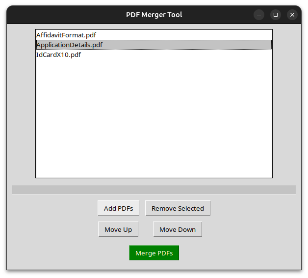
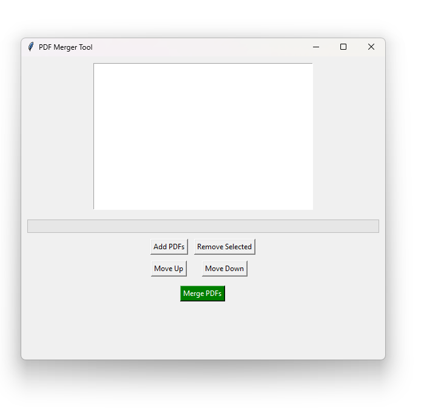

# PDF Merger Tool

A simple desktop application to merge multiple PDF files using a graphical user interface (GUI) built with Tkinter and PyPDF2.


## Features
- Add multiple PDF files to a list
- Remove selected PDFs from the list
- Reorder PDFs (move up/down)
- Merge selected PDFs into a single file
- Save the merged PDF to your chosen location

## Requirements
- Python 3.x
- PyPDF2 (install via pip)
- Tkinter (usually included with Python, but may require system installation on Linux)
- TkinterDnD2 (install via pip)

## Installation

### Linux - Developer
1. **Clone the repository or download the source files.**
2. **Create a virtual environment (recommended):**
   ```bash
   python3 -m venv .venv
   source .venv/bin/activate
   ```
3. **Install dependencies:**
   ```bash
   pip install -r requirements.txt
   ```
4. **If you get errors about Tkinter, install it via your system package manager:**
   ```bash
   sudo apt-get install python3-tk
   ```

## Usage
Run the application:
```bash
python __main__.py
```

A window will open where you can add, remove, reorder, and merge PDF files.

## File Structure
- `__main__.py`: Main application code
- `requirements.txt`: Python dependencies

## Testing
Unit tests for core functionalities are provided in `test_toolkit.py`.
Run the tests with:
```bash
python test_toolkit.py
```

## Troubleshooting
- If you see errors related to Tkinter, make sure it is installed on your system (see Installation step 4).
- Only PDF files are supported for merging.